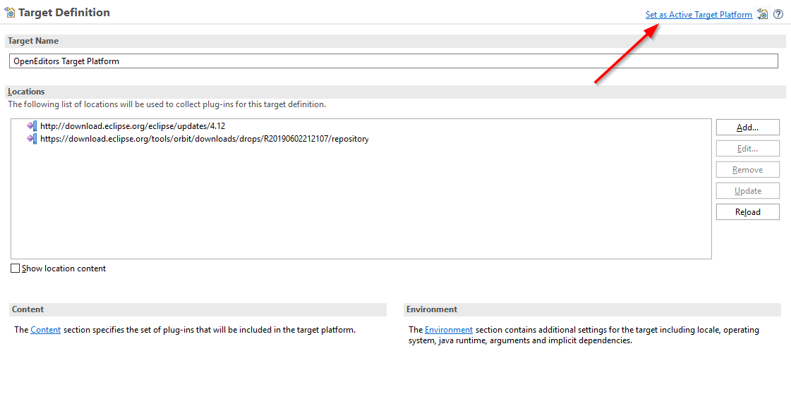

This is an Eclipse plugin that adds commands to cut and copy a complete line or the selected text, depending on the selection.
If there is no text selected then the complete line is cut / copied. Otherwise the selected text is cut / copied as usual.

Update Site: https://raw.githubusercontent.com/achimmihca/EclipseLineShortcuts/release/updatesite

# Screenshots

 

# Development Environment Setup
The following explains how to set up your Eclipse IDE to continue the development of this plugin.

1) Clone the repository
1) Download and start Eclipse
1) Install the plugin Development Tools (PDE) if not done yet
    1) Help > Install New Software...
    1) Work with `download.eclipse.org/releases/...`
    1) Select 'General Purpose Tools' > 'Eclipse Plugin Development Environment.'
1) Import the projects from the cloned repository
    1) File > Import... > Existing Projects Into Workspace
    1) Select the repository location and import all projects

1) Configure the Target Platform. It must contain all required plugins and should not contain to much bloat, such that the test environment starts up quickly.
    1) A Target Platform has been prepared in `config/target-platforms`. Open the file and click 'Set as Active Target Platform' in the upper right corner.
     

1) Run the plugin in a new Eclipse instance.
    1) Use a launch configuration for an Eclipse Application and select on the plug-ins tab the plugins from the target-platform and the current workspace.

## Conventions and Configurations

1) Use spaces instead tabs: Preferences > General > Editors > Text Editors > Insert spaces for tabs: true

1) Enable UTF-8 encoding: Preferences > General > Workspace > Text file encoding: UTF-8

1) You can find the code style configuration in `config/code-style`.
    1) Import the configuration file in Eclipse under Preferences > Java > Code Style > Formatter.

    1) Enable formatting on save using Save Actions: Preferences > Java > Editor > Save Actions > Format source code
     

## Building the Update Site

The Eclipse Update Site for this plugin is hosted also on GitHub. You find it in the 'updatesite' folder. The folder in the 'master' branch is for alpha versions and pre-release testing, whereas the 'release' branch contains the released versions of the plugin that are considered stable.

The plugin project contains the code for the plugin. On the other hand, the feature project (ends with '.feature') contains information to bundle and deploy the plugin as an Eclipse Update Site.

1) Delete all old content in the updatesite folder

1) Go to File > Export... > Deployable Feature
 

1) Choose a target directory.

1) Under the 'Options' tab, make sure that 'Categorize repository' is checked and the corresponding `category.xml` is selected.
 

1) Hit 'Finish'